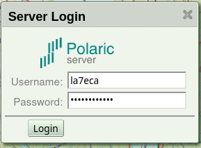
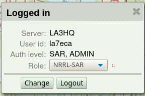

 
Client authentication
=====================

In version 3.0 the login scheme is replaced with a scheme more suited for REST API and mobile-apps. 
Clients (users) with web-browsers or mobile-apps, can log in to the server using the username and a password. The client code may call a method POST to a url ``directLogin`` with the form parameters: 'username' and 'password'. If login is successful, a session-key (base64 encoded, 64 characters long), will be returned and can be used in authenticating subsequent requests to the server as well when establishing websocket connections. This key should be treated as a secret. It is not persistent, so when the server reboots users have to log-in again. 

After a successful login the client can call the GET method on the url ``authStatus`` which will return info on server capabilities and what authorizations the users have. If authentication fails, it returns an error code (401 unauthorized). If authentication fails, a GET on an alternative ``authStatus2`` can be used to get some information about the server-session anyway.  

.. note::
    This is supported from aprsd version 3.0

Login using polaric-webapp2 client
----------------------------------

In the webapp, login can be done with a widget (popup) like this:

If login is successful (the ``authStatus`` method returns sucessfully, the widget will change and a logout button will be available. In addition it is possible to temporarily change the role (if user is authorized for that). Here, logout will simply mean to remove the session key so that the subsequent REST calls will not do proper authentication.

HTTP requests
-------------

A request to a REST API can use the Authorization HTTP header the following way:: 

 Authorization: Arctic-Hmac userid;nonce;hmac;role

The data field consists of the following (separated by semicolon): 

**userid**
    The username used in the login
**nonce** 
    A number unique for each REST call. The webapp generates a 64 bit (8 bytes) random number. This is base64 encoded. 
**hmac** 
    A HMAC hash using the key returned by the ``directLogin`` call and a concatenation of the nonce and a 
    SHA256 hash of the request body if it exists. The HMAC is base64 encoded.
**role** (optional)
    We can add a temporary role-id if user is authorized for more than one role. 

Websocket creation
------------------

When opening a websocket connection we can authenticate by adding the string *userid;nonce;hmac;role* (where *;role* is optional) as described above as a request parameter to the wss URL. If authentication is successful the server will threat communication over the resulting websocket as authenticated and with the resulting authorizations. 

Server-Server authentication
============================

A similar authentication scheme is used for other server instances needing to access REST APIs or Websocket interfaces. It could also be used for access from IoT devices. This authentication scheme doesn't identify web-browser users (typically persons) but rather services. In the current version, there is just one level of authorisation. 

.. note::
    This is supported from aprsd version 3.0.

HTTP requests and websockets
----------------------------

HTTP(S) requests are authenticated the same way as for browser logins; an Authorization header is used with *userid*, *nonce* and *hmac* fields. The *role* field is not used and the *userid* identifies a service rather than a person. Websockets are also created like described above except that the optional ';role' is not used. 

Secret Key
----------

The secret key is manually installed on each server participating, in the file ``/etc/polaric-aprsd/keys/peers``. Entries in this file are in the following format:: 

 service-name : key

Where the service-name can be used to identify a particular REST API and/or websocket service. The key is a random sequence of characters. It is recommended to use a secure random function to generate this and that they are Base64 encoded. 64 bytes is the recommended length of the key.

Currently there is one service using this sheme: The ``dbsync`` of the Database plugin. 
