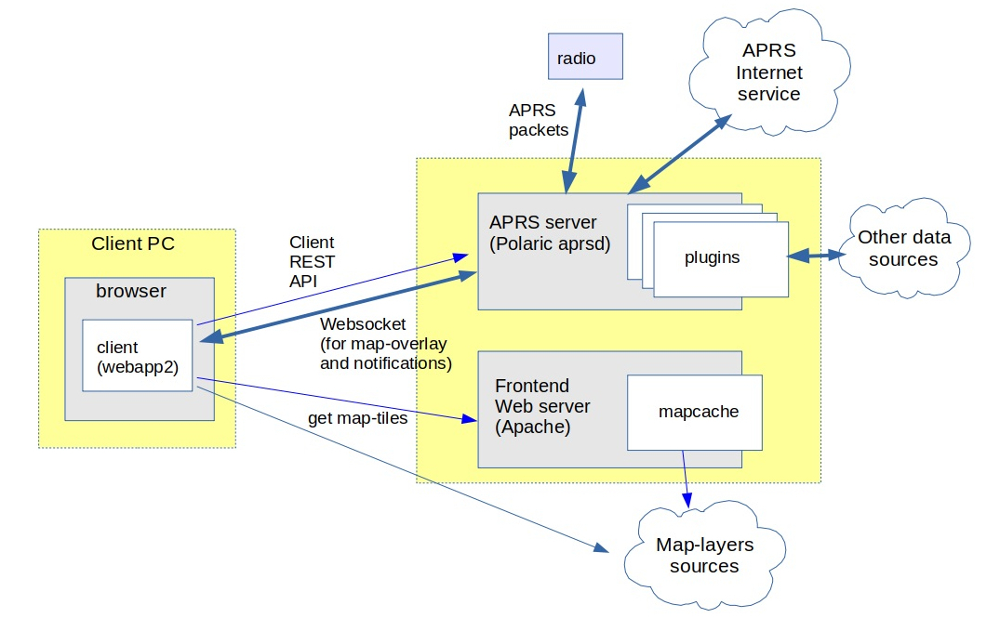

******** 
Concepts
********

This chapter aims to give a guide to the architecture and main features of Polaric Server. 

**Anything still unclear? Feedback is welcome!**

Software architecture overview
------------------------------

*Polaric-Server* is a client/server application, where users run the client-app in their web-browsers or as smartphone apps. The figure below shows the most important parts of this. A server typically serves the *Polaric-Webapp2* (client) component which is mainly written in Javascript. It functions as a GIS client that can browse map-layers from various sources, let the user draw featurs on the map, etc. It is based on `OpenLayers <http://www.openlayers.org>`_. 

*Polaric-Webapp2* sets up a (Apache) webserver to serve the application itself (as a kind of a homepage); we call it the *'frontend-server'*. This can also function as a *cache* for map-tiles for various sources by using Apache and the `Mapcache plugin <http://www.mapserver.org/mapcache>`_. Mapcache can handle standard map-tile sources like WMS, WMTS, etc. The *Webapp2* client can use map-tile sources, but also vector sources like WFS, GPX, GeoJSON, etc. We can use the very rich capabilities of *OpenLayers* for this. 

It is also a client for the *Polaric-aprsd*; we call it the *'backend-server'*. It is a http server that runs on a different port than the frontend. *Polaric-aprsd* handles more dynamic position information, typically moving objects. It provides a REST API to clients for performing various operation, as well as a Websockets to push updates and notifications asynchronously. It offers an innovative way of filtering what the user sees (and how), and a way to use tags to help filtering and searching items. It offers user-login and role-based authorization.

Aprsd is primarily an *APRS client* (and even an APRS igate if configured to do so); it can use a radio or the APRS-IS network to send or receive APRS packets. It is not limited to APRS; it can handle other datasources like e.g. AIS by using *plugins*. Plugins is a way to extend aprsd's functionality. A special and important plugin is the *database-plugin* which uses a PostgreSQL database (with PostGIS extension) to extend the capabilities of aprsd. It can store tracking-data and let users search historical trails or see snapshots at particular time-instants. It can store user-defined features and it can synchronize some information with other server-instances.  

Interoperability and extensibility
----------------------------------

Polaric Server is a free and open-source client/server application that supports interoperability and extensibility. Interoperability refers to the ability of different systems, applications, or components to exchange information and work together effectively. Extensibility is the ability to add functionality with minimal need to change the core application. All this can be achieved through:

* *Standardized Protocols*: The client and server communicate using standardized protocols, such as HTTP or WebSocket, which allow systems developed by different vendors or using different technologies to interact seamlessly.

* *Data Formats*: The application uses common data formats, like JSON for exchanging information. These formats can be easily parsed and processed by various systems, regardless of the programming language or platform used.

* *Application Programming Interfaces (APIs)*: The server component exposes well-defined RESTful APIs that can be consumed by different clients. APIs provide a consistent and standardized way for applications to communicate and share data, facilitating interoperability.

* *Internal API* with some support for running plugins in the server-application. Object-oriented software design with classes and interfaces.
    
This means that alternative clients to the system is possible (and encouraged). The system can utilize open GIS data from various source through open protocols like WMS or WFS. Different instances of the backend-server can exchange and synchronize information and other applications can communicate with the aprsd backend server in order to share information. 

Supported geographical objects
------------------------------

Polaric aprsd is designed to  handle geographical points and display them on a map. 

Tracker objects. 
   APRS stations or objects. AIS vessels, etc.. They can be moving and can have significant metainformation attached, including timestamp. 
They have *trails* of movement. A trail is a list of updates (each with a timestamp and position) covering a timespan.  
Signs. 
   Simpler *"Lightweight"* objects that are *static* (non moving). They can be shown with smaller 
   icons and have typically no label on the map. A sign can provide a link to an image or web-page. 
Other types of objects. 
   For example non-moving objects with more semantics than simple signs. Defined by plugins. 

A *database* (if using the *database plugin*) can store signs or updates to tracker-objects. If this plugin is installed and active, it can provide historical seach and show locations on earlier time-instants or trails of movements in given time-spans. 

Clients like *Polaric Webapp2* are GIS applications that can handle maps and map-layers, as well as more static geographical features to be drawn on maps, in addition to more dynamic information from aprsd backends. 

Tags
----

Geographical points (trackers, stations, objects.. ) can be tagged with keywords that can be used in searching or more semantics can be defined in filter profile scripts.

Tags can ble single words or composite words with the '.' as a delimiter. A composite tag x.y implies the prefix x, for example a tag 'APRS.infra' also means 'APRS'.

Tags can be set manually or automatically. In the filter profile script it is possible to define rules for automatic tagging (AUTOTAG), based on various attributes or tags already set on the points. Some automatic tagging are also hardcoded into the system. Tags that are set manually can be removed manually. If you try to remove manually a tag that is set automatically, a negative tag (prefixed with a '-') will be added that neutralizes its effect. A negative tag can be removed.

Manual tags are prefixed with a '+' by the system. Users don't usually see this prefix.

Tags can in principle be freely chosen, but the system administrator should consider publishing what tags that actually give a meaning (a controlled vocabulary) and users should use those tags instead of inventing their own. When doing manual tagging the already used tags are listed and can easily be selected. It is also a good idea to standardise some tags to support interoperability between different Polaric Server instances.

Tags that are added manually, are propagated to other servers connected via the remote control protocol.

Tags that are set by Polaric Aprsd:

* ``APRS.infra``: Node is classified as active APRS infrastructure
* ``APRS.infra.igate``: Node is also classified as an igate
* ``APRS.infra.wdigi``: Node is also classified as a wide digipeater
* ``APRS.telemetry``: Node sends APRS telemetry
* ``own``: Object is owned/generated by this Polaric Server instance.

Tags that are set by AIS plugin:

* ``AIS.SAR``: Search and Rescue vessel (code 51)
* ``AIS.medical``: Ambulance/medical (code 58)
* ``AIS.law``: Law enforcement (code 55)
* ``AIS.special``: Other special vessel types (code 5x)
* ``AIS.passenger``: Various kinds of passenger vessels (code 4x, code 6x).
* ``AIS.cargo``: Cargo vessels (code 7x)
* ``AIS.tanker``: Tankers ( code 8x).

Suggested general tags:

* ``SAR``: The point of interest is involved in a SAR operation.
* ``OPEN``: The point of interest should be visible for all users.

Filters
-------

To deal with information overflow, we can define filters that configure what dynamic geographical objects are to be shown on the map and how those are shown. The user can select among pre-defined filters. Filters are defined in a special script containing rules and can be based on tags or other properties. For such filters we may also define what groups of users the filters are available for, i.e. we can define who are allowed to see what. 

In the filter script we can also define rules for auto-tagging (see above). 

The webapp client get a list of available filters from the server and present those in a menu to allow the user to select.

