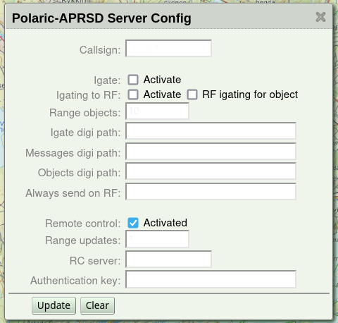
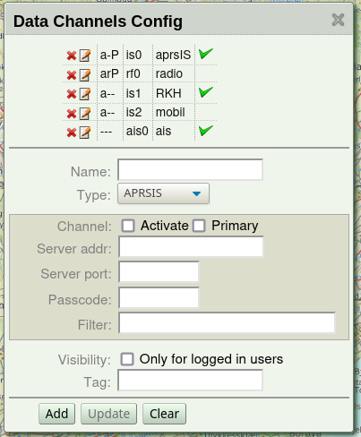
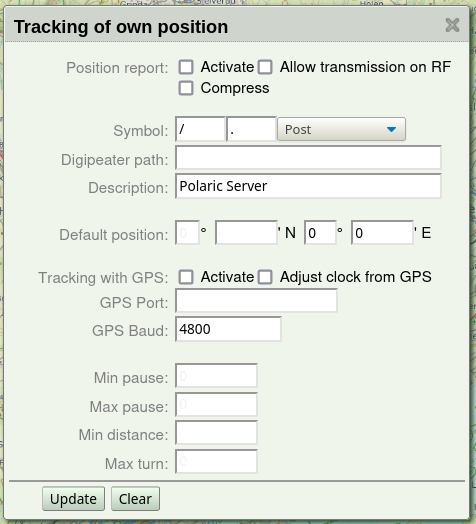

 
Basic setup of Polaric APRSD
============================

The most important settings can be done via the web-interface. It is a good idea to do this as soon as the server is up and running. You will need to log-in with *admin* (superuser) rights. The package initially comes with an admin-user (*‘admin’*) with password *‘polaric’*. You should of course change the password. You may use the command shell to do this::

    polaric-passwd admin

You will be prompted twice for new password. You may also change your password using the webapp. 

As soon as you have installed *webapp2*, and this is up and running, you can use your web-browser to see the map and some menus. You can click the icon which looks like a lock. Log on with username and password. If this succeeds, the window will show that you are logged in. To change your password, see the menu: *'Set/change password'*. Note that any user can change his/her own password. The superuser (*'admin'*) can change password of any other user as well. If you have superuser rights, you can click the main menu and select *'System admin'* and another menu pops up with the following choices: 

* *Status info* (see info about running system and connected clients)
* *User admin* (manage user-accounts)
* *Server config* (Basic server onfiguration)
* *Own pos config* (Use server as a position tracker)
* *Channels config* (set up channels)
* *Synch nodes* (experimental: synchronisation between instances)

Basic server settings
---------------------

To start the setup, choose *'Server Config'* in the menu. You will now see a set of fields that can be filled in or changed. They are fairly self-explanatory. If you haven't set the callsign yet, now is a good time. 'NOCALL' is default but should set your own! The other settings can wait a little. They are as follows:

* **Igate settings**. *Polaric-aprsd* is capable of running as a full igate if required. If you set up the server with both internet and TNC/Radio it *may* be useful to activate the igate. Don't activate it if you don't need it. The igate use the channels which are marked as the primary RF and APRS-IS channels (in channel-setup). Make sure that these channels are correctly configured *before* you activate the igate.

* **Connection to another Polaric Server instance** (over APRS) for remote control and synchronization of SAR information (alias, tags, etc..). Servers to be connected, need to agree on a common secret (authentication key). *This is for advanced users*.

When you are done with settings on this page, click *'Update'* and you can move on to another set of settings. 

Configuration of data channels
------------------------------
The picture below shows how it looks like. You see a list of channels and the running status of those. You may delete or add channels. Or you may click the edit-icon to se more detailed info and edit settings of the channel. 

Up to two channels may be marked as *primary*. One Internet-channel and one radio-channel. This is needed when igate is activated or the server needs to send out things on APRS. Extra channels that are not primary are normally receive-only. 

One APRS-IS channel (aprsIS) is already set up and activated. The channel may for example use the server *`aprs.no`*, port 14585 which automatically delivers APRS traffic from Norway. Users in other countries should change the APRS-IS server. You should also add a *passcode* which will allow you to send data to APRS-IS as well. This code is generated based on your *callsign*. There are programs or services on the net that can generate a passcode for you if you have a valid callsign. You should also set a filter expression that says more specifically what you want from the APRS-IS server. The filter should be set to accept data from your geographical area of interest or types of data you need. Note that this filter is necessary if you use the general port 14580. See more information about such filters. 

The radio channel is not activated by default. If you need to use a TNC or a radio with builtin APRS, you can configure and activate this channel. Here are the settings:

* **Type**: ``TNC2`` for TNC2 compatible TNC. Use this for Kenwood radios with builtin APRS. Use ``KISS`` for TNCs in KISS mode. It is also possible to use ``TCPKISS`` (KISS over internet). A channel should be deactivated before changing the type. After changing type, click 'Update' to get the right fields to fill in (you may also need to reload the page).
    
* **Port**: Serial port or USB-serial port, as they are named in Linux. For instance, *`/dev/ttyS0`* would correspond to the COM1 serial port. If you plug in a USB serial converter or a radio with a USB plug, the port name will typically *`/dev/ttyUSB0`* or *`/dev/ttyACM0`* depending on what hardware is used. One way to find out what port-name is assigned to a USB device is to type *'dmesg'* in the command shell after the device is plugged in to look at the system log.

* **Baud-rate** for serial port.

If type is ``TCPKISS``, you fill in the IP-address (or server domain name) and a port number. ``TCPKISS`` is useful e.g. if using *Polaric-aprsd* along with programs like *Direwolf*. Actually, it may be used to access any TNC over a serial device, using a serial to network proxy like *ser2net* or *tcptty*. This can be more flexible and reliable than using the serial port directly from Polaric-aprsd and is therefore recommended.    

The type can be non-radio and even non-aprs. Plugins may add types. What fields to fill inn depends on the type. If clicking on the *edit* icon on the channel list, the proper fields are shown. If the channel is active, it will also show some statistics like number of received packets. 

Positioning
-----------

*Polaric-aprs* can be set up to send position reports like a tracker. It will only send such reports on APRS-IS unless you explicitly allow it to send it on RF. A digipeater path would be used on RF. You may use a GPS on a serial port and you may also use the NMEA packets from the GPS to adjust the clock. If GPS is not used or if it doesn't get a fix, we may use a default fixed position (given in UTM format). 

A smart-beaconing algorithm will be used when position changes. The frequency of the reporting will depend on the spead and direction of the movement. Min-pause is the minimum time between transmissions. Max-pause is the maximum time between transmissions. Min-distance is the distance (should be called max-distance) moved before a transmission is generated and max-turn is the maximum change in direction before a transmission is generated. 

To activate the settings
------------------------

For each page of settings click the *'Update'* button to save your changes. Changes to channels will take effect immediately. Other changes may need a restart to become active. 
